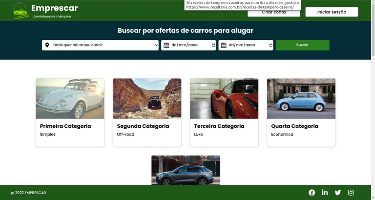

# Emprescar - aluguel de carros

#### Projeto acadêmico com base num e-commerce de aluguel de carros


## Práticas adotadas

- SOLID, DRY, YAGNI, KISS
- API REST
- Consultas com Spring Data JPA
- Injeção de Dependências
- Tratamento de respostas de erro

## Índice

- [Instalação](#installation)
- [Configuração](#configuration)
- [Uso](#usage)
- [API Endpoints](#api-endpoints)
- [Base de dados](#database)

## Installation

1. Clone the repository:

```bash
git clone https://github.com/wkoju84/emprescar-backend.git
```

2. Instale dependências com Maven


```
## Uso

1. Inicie a aplicativo com Maven
2. A API estará acessível em http://localhost:9000

## API Endpoints
A API fornece os seguintes endpoints:

**API PRODUCT**
``` markdown
POST /product - Crie um novo produto
GET  /product - Lista todos os produtos
PUT  /product/{id} - Atualiza um produto selecionado
DELETE /product/{id} - Deleta um produto
```

**BODY**
```json
 {
  "id": 1,
  "name": "Hyundai HB20",
  "description": "Aceleração de 0 a 100 km/h: 9,3 - 14,5 segundos/ Volume de carga: 300 - 475 l/ Tração: Tração dianteira/ Portas: 4, 5",
  "features": [
    {
      "id": 1,
      "name": "Ar-Condicionado",
      "icon": "snowflake"
    },
    {
      "id": 2,
      "name": "Ar-Condicionado",
      "icon": "snowflake"
    },
    {
      "id": 4,
      "name": "Vidro Elétrico",
      "icon": "car"
    },
    {
      "id": 7,
      "name": "Alarme",
      "icon": "bell"
    },
    {
      "id": 3,
      "name": "Direção Hidráulica",
      "icon": "gear"
    },
    {
      "id": 5,
      "name": "Trava Elétrica",
      "icon": "lock"
    }
  ],
  "category": {
    "id": 1,
    "name": "Primeira Categoria",
    "rating": 1,
    "description": "Simples",
    "url": "https://images.unsplash.com/photo-1490985830292-06e0fe60d725?ixlib=rb-4.0.3&ixid=MnwxMjA3fDB8MHxwaG90by1wYWdlfHx8fGVufDB8fHx8&auto=format&fit=crop&w=1132&q=80"
  },
  "city": {
    "id": 1,
    "name": "Lauro de Freitas",
    "country": "Brasil"
  },
  "images": [
    {
      "id": 1,
      "title": "Hyundai HB20",
      "url": "https://gitlab.com/JaiJuni0r/grupo_3/uploads/4e477019c67aaf32d7f9279b6455b010/image.png"
    }
  ]
}
```

**API CATEGORY**
```markdown
POST /category - Cria uma nova categoria
GET /category - Lista todas as categorias
PUT /category/{id} - Atualiza categorias
DELETE /category/{id} - Deleta uma categoria
```

**BODY**
```json
  {
  "id": 1,
  "name": "Primeira Categoria",
  "rating": 1,
  "description": "Simples",
  "url": "https://images.unsplash.com/photo-1490985830292-06e0fe60d725?ixlib=rb-4.0.3&ixid=MnwxMjA3fDB8MHxwaG90by1wYWdlfHx8fGVufDB8fHx8&auto=format&fit=crop&w=1132&q=80"
}
```

**API CITIES**
```markdown
POST /cities - Cria uma nova cidade
GET /cities - Lista todas as cidade
PUT /cities/{id} - Atualiza cidade
DELETE /cities/{id} - Deleta uma cidade
```

**BODY**
```json
  {
  "id": 1,
  "name": "Lauro de Freitas",
  "country": "Brasil"
}
```

## Screenshots

Página Inicial

<p align="center">
  
</p>

